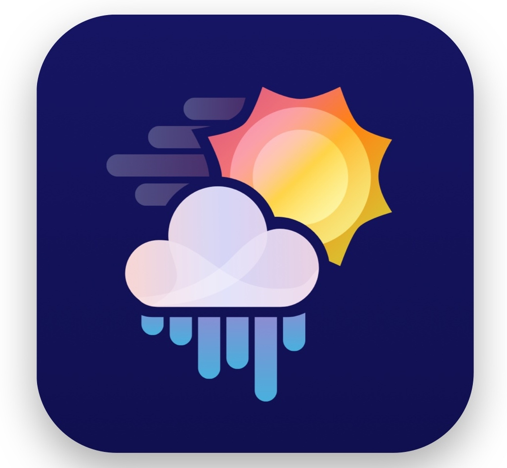

<p align="center">
  
</p>

<h1 align="center">
   Rainy Day
</h1>

<p align="center">Check out the Weather Anytime, Anywhere</p>

<p align="center">
  

  

  <a href="https://github.com/th92rodr/rainy-day/commits/master">
    
  </a>

   

   <a href="https://github.com/th92rodr/rainy-day/stargazers">
    
  </a>
</p>

<p align="center">
  <a href="https://www.repostatus.org/#wip"></a>
</p>

<p align="center">
 <a href="#about">About</a> •
 <a href="#features">Features</a> •
 <a href="#tech-stack">Tech Stack</a> •
 <a href="#layout">Layout</a> •
 <a href="#how-it-works">How it works</a> •
 <a href="#license">License</a>
</p>

## About

Check out the current weather and the following days forecast.

## Features

- [x] API: Get Current Weather by Address or by Coordinates
- [ ] UI: Get Current Weather by Address or by Coordinates
- [x] API: Get Forecast by Address or by Coordinates
- [ ] UI: Get Forecast by Address or by Coordinates
- [ ] API: Register Users
- [ ] UI: Register Users
- [ ] Send Daily / Weekly Emails For Registered Users

## Tech Stack

The following tools were used for building this project:

**API**

- [Node.js](https://nodejs.org/en/)
- [Express](https://expressjs.com/)
- [TypeScript](https://www.typescriptlang.org/)

**Website**

- [React.js](https://pt-br.reactjs.org/)
- [Styled Components](https://www.styled-components.com/)

---

## Layout

WIP

---

## How it works

This project makes use of the OpenWeatherAPI, so you will need to generate an OpenWeather API Key for the application to run properly.

To do that following theses steps:

- Create an account at [Open Weather](https://openweathermap.org/api).

- After you are signed in, select the `API keys` tab.

- From here you can `Create a Key` on the right hand side of the page. Enter a name (anything works) and select generate. Your `API Key` will appear on the left.

- Place this API Key in the `.env` file inside the `api` folder.

### Pre-requisites

Before you begin, you will need to have the following tools installed on your machine:

- `Node.js`<br />
  recommend version 12.18

  `Node` can be installed from `https://nodejs.org/en/`.

- `NPM` or `Yarn`

  - `NPM`:<br />
    recommend version 6.14

    Installing `Node` will also install `NPM` automatically.

  - `Yarn`:<br />
    recommend version 1.22<br />
    required version 1.\*

    `Yarn` can be installed from `https://classic.yarnpkg.com/en/`.

### Running the API

Make sure you are inside the `api` folder, then follow these steps:

- Install the project dependencies:

```sh
yarn install
# or
npm install
```

- Build the API:

```sh
yarn build
# or
npm run build
```

- Start the API:

```sh
yarn start
# or
npm start
```

The API will be running on PORT `3333`.

### Running the Web App

WIP

---

### Testing the API

Make sure you are inside the `api` folder, then follow these steps:

- Install the project dependencies:

```sh
yarn install
# or
npm install
```

- Run tests:

```sh
yarn test
# or
npm run test
```

- Run coverage:

```sh
yarn coverage
# or
npm run coverage
```

### Testing the Web App

WIP

---

## License

This project is under the license [MIT](./LICENSE).
